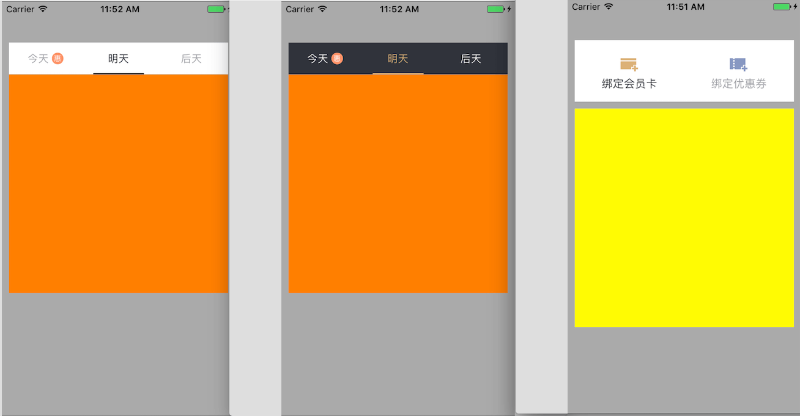

# JCSegmentBarController

[](https://travis-ci.org/lijingcheng/JCSegmentBarController)
[](http://cocoapods.org/pods/JCSegmentBarController)
[](https://github.com/Carthage/Carthage)
[](http://cocoapods.org/pods/JCSegmentBarController)
[](http://cocoapods.org/pods/JCSegmentBarController)

Simple to use and support horizontally-scrolling.

 

## Installation

Installation with CocoaPods

```
pod "JCSegmentBarController", "2.0.5"
```

Installation with Carthage

```
github "lijingcheng/JCSegmentBarController" == 2.0.5
```

## Usage

Refer to demo

## Author

[李京城](http://lijingcheng.github.io)

## License

MIT
